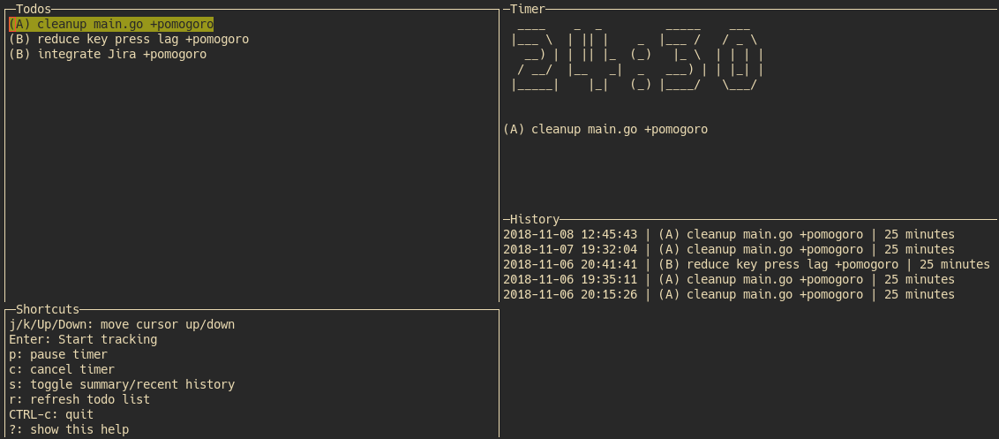

# Pomogoro

Pomogoro is a command-line tool to combine [todo.txt](http://todotxt.org/) (or
any other text based todo file) and
the [Pomodoro Technique](http://francescocirillo.com/pages/pomodoro-technique).



## Features

* made to work with `todo.txt` files but is compatible with any line-based text
    files
* time tracking history per task per day
* OS notifications (pomodoro finished, break started, break finished)
* option to enable/disable pomodoro style tracking
* configurable pomodoro and break durations
* auto break after one pomodoro is finished

## Installation

### Option 1: get a binary

Go to [Releases](https://github.com/phux/pomogoro/releases) and grep the
appropriate release for your architecture.

```
# extract
tar -xvzf <release.tar.gz>
# move the binary to a directory in your $PATH
mv pomogoro ~/.local/bin

```

### Option 2: `go get`

* [go dep](https://github.com/golang/dep)

```
go get -u github.com/phux/pomogoro
cd $GOPATH/src/github.com/phux
dep ensure
go install
```

After this you can start pomogoro via

```
pomogoro --config <absolute/path/to/config.toml>
```

## Configuration

You need to pass an absolute path to a config.toml file via `--config
/your/path/to/config.toml`.

```
# config.toml
TodoFile = "/absolute/path/to/your/todo.txt" # containing the tasks you want to track
LogFile = "/absolute/path/to/pomogoro.log" # tracking log file
BreakDuration = 5 # in minutes
PomodoroEnabled = true # whether to use pomodoro timer or not
PomodoroDuration = 25 # in minutes
```

## Keybindings

| Key           | Function                                                   |
| ---           | ---                                                        |
| `j/k/Up/Down` | Scroll down/up in windows                                  |
| `Enter`       | Start tracking on current task in the todo window          |
| `p`           | Toggle: Freeze timer                                       |
| `c`           | Cancel current timer (task or break)                       |
| `s`           | Toggle between summary per task per day and recent history |
| `r`           | Refresh todo list                                          |
| `CTRL-c`      | quit                                                       |

## Todos

- [ ] reduce 1s lag after key press
- [ ] cleanup codebase & more tests
- [ ] Jira: Fetch tasks & push time trackings

## Built With

* [gocui](https://github.com/jroimartin/gocui) - Terminal UI

## License

This project is licensed under the MIT License - see the [LICENSE.md](LICENSE.md) file for details
